#### Introduction to LLMs and Azure AI Services

In this lab, we will have an overview on how to use Azure AI to work with large language models.

The focus will be more on an overview of the creation process, so that in the next lessons we will delve deeper into the build, evaluation, deployment, and monitoring process.

#### Prerequisites

An Azure subscription is required, where you can create an AI Project along with its AI Resource, a Content Safety service ie Guardrails & controls, New Agent Framework and an AI Search service.

#### Setup

- [Create an AI Project ](#create-an-ai-project)
- [Deploy an Azure OpenAI model](#deploy-an-azure-openai-model)

#### Lab Steps

1) Use Azure AI Foundry Playground.
2) Work with an Open Source LLM Model.
3) Test the prompt in Content Safety.


#### Setup

#####  Create an AI Project

Let's start by creating a project in Azure AI Studio.

Go to your browser and type: https://ai.azure.com

Microsoft Foundry portals : There are two different portals for you to use to interact with Microsoft Foundry. A toggle in the portal banner allows you to switch between the two versions.

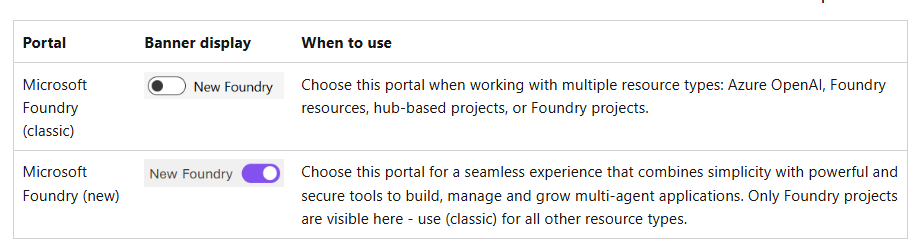

After logging in with your Azure account, toggle to new version of AI Foundry, you will see the following screen:

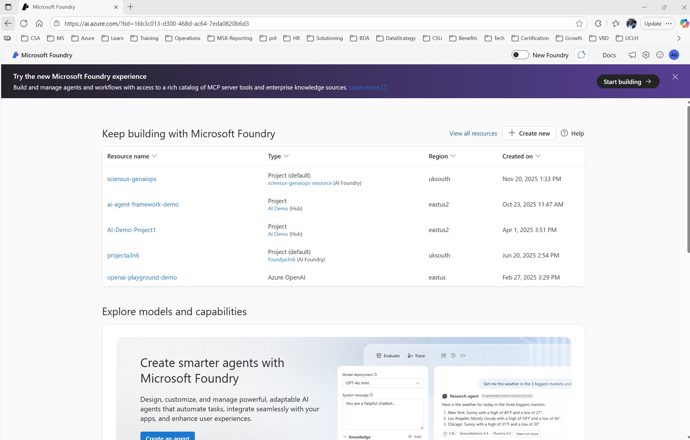


[Follow the instrcution to create project in new AI Foundry](https://learn.microsoft.com/en-gb/azure/ai-foundry/how-to/create-projects?view=foundry&tabs=foundry#create-a-foundry-project)
Sample screen short & steps to create project

Step 1: 
Step 2: 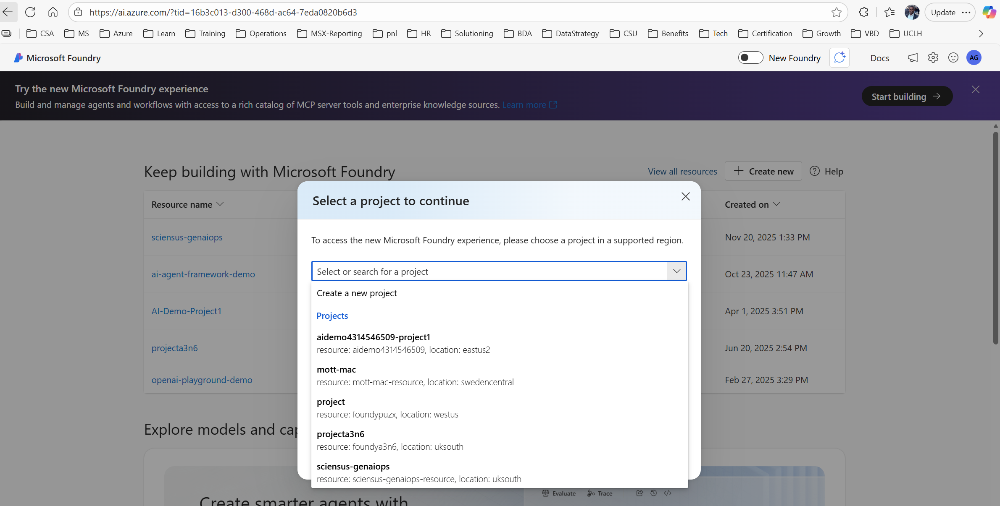
Step 3: 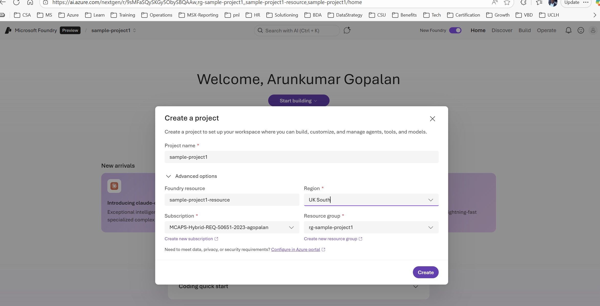
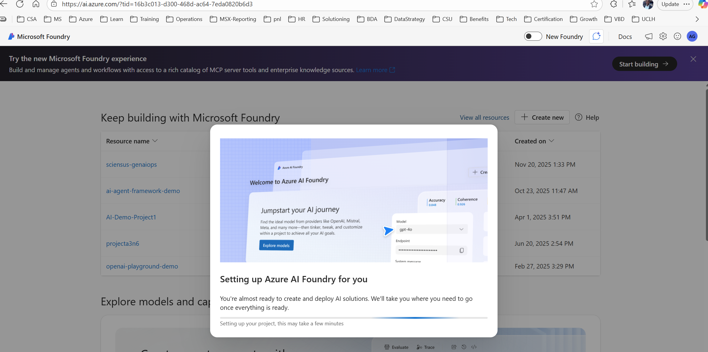
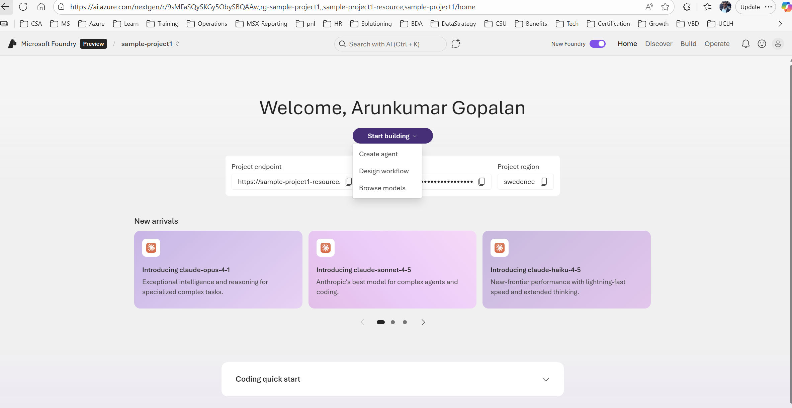

Now create LLM Deployment

##### Deploy an Azure OpenAI model

After creating your AI Project, the first step is to create a deployment of an OpenAI model so you can start experimenting with the prompts you will use in your application.

To do this, access your newly created project in the **Discover** tab of the AI Studio, select the **Models** option, and search on **GPT4**. Select **GPT-4.1** model and click on **Deploy** with **Custom Settings**

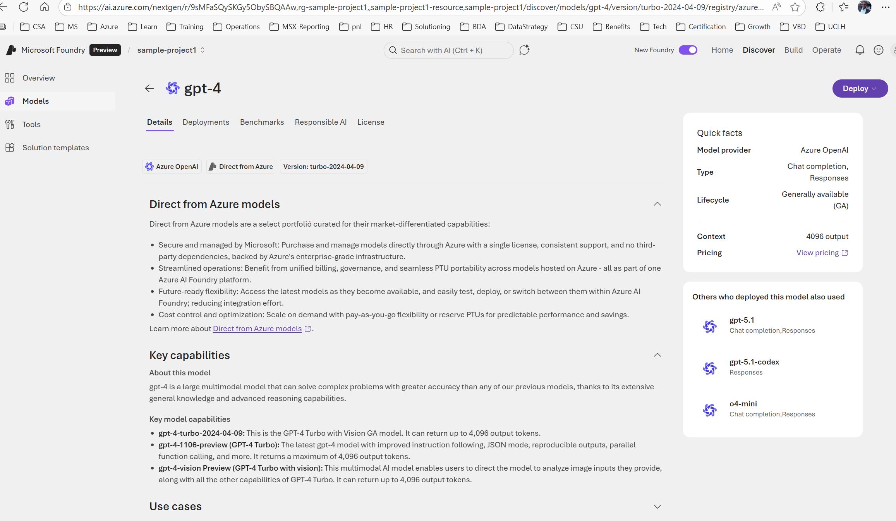

From the list of models, select **gpt-4.1**.


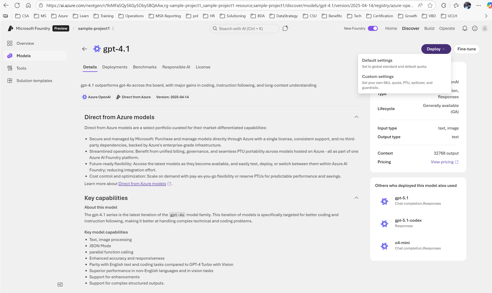


On the next screen, define the name of the deployment, in this case, you can use the same name as the model and in the version field select the latest available version, in the example below we chose version.

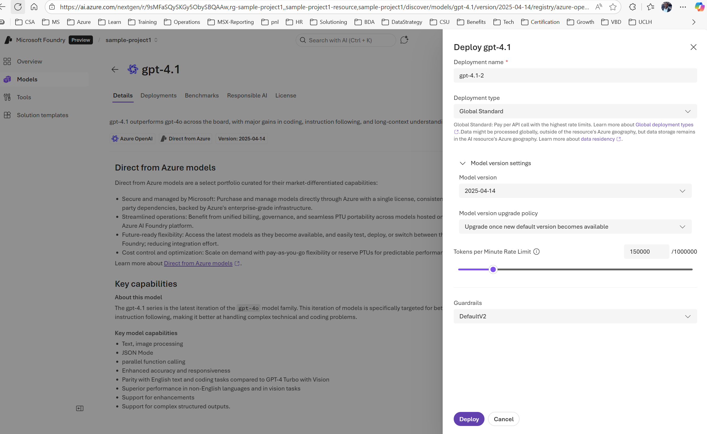

> For Token Limt  select at least 40K **Tokens per Minute Rate Limit*** to ensure the flows run smoothly in the upcoming lessons.

Now, just click on **Deploy** and your model deployment is created. You can now test it in the Playground.

##### Create a Content Safety 

By the end of this lab, you will test with Content Safety. Therefore, click on the following link to create it [https://aka.ms/acs-create](https://aka.ms/acs-create). 

Select the resource group that you previously used for your AI Project. After that, follow the steps presented in the subsequent screens to continue with the creation process, start by clicking on **Review + create** button


Then click on **Create** to create your service.


Done! The Content Safety service is now created.


#### Lab Steps

##### 1) Use Azure AI Foundry Playground

On the screen with the deployment information, select the **Open in playground** button.

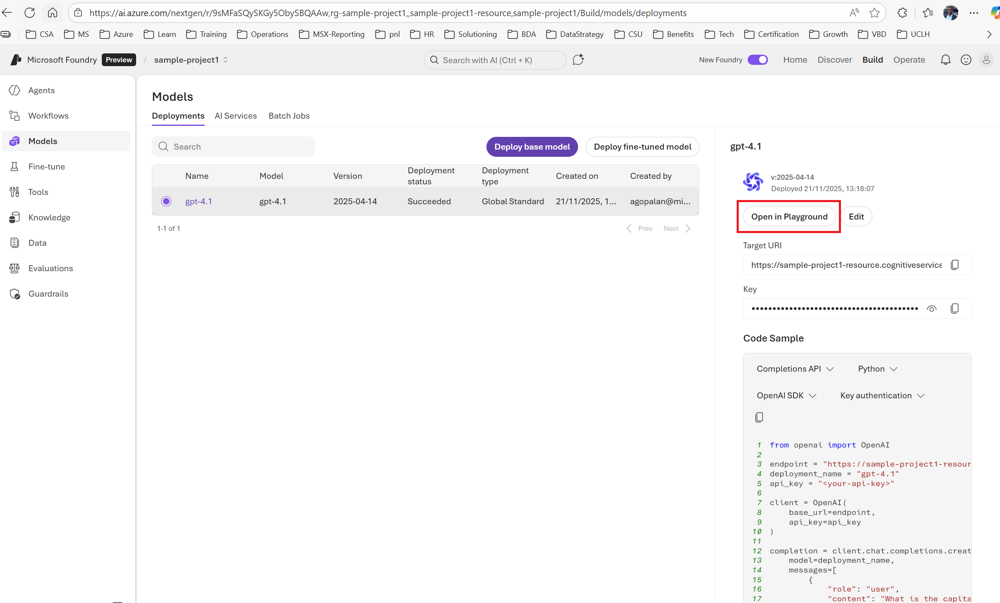

In this lab, we will run an example where the model will help us summarize and extract information from a conversation between a customer and a representative of a telco company.

Copy the following prompt into the system message field of the playground:

```
You're an AI assistant that helps telco company to extract valuable information from their conversations by creating JSON files for each conversation transcription you receive. You always try to extract and format as a JSON:
1. Customer Name [name]
2. Customer Contact Phone [phone]
3. Main Topic of the Conversation [topic]
4. Customer Sentiment (Neutral, Positive, Negative)[sentiment]
5. How the Agent Handled the Conversation [agent_behavior]
6. What was the FINAL Outcome of the Conversation [outcome]
7. A really brief Summary of the Conversation [summary]

Only extract information that you're sure. If you're unsure, write "Unknown/Not Found" in the JSON file.
```

After copying, 

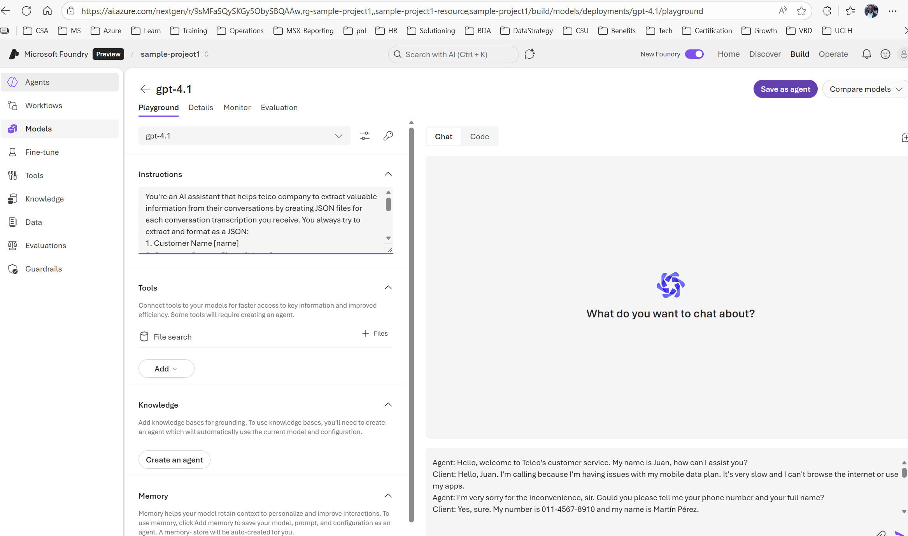

Then type the following text in the chat session and click the send button:

```
Agent: Hello, welcome to Telco's customer service. My name is Juan, how can I assist you?
Client: Hello, Juan. I'm calling because I'm having issues with my mobile data plan. It's very slow and I can't browse the internet or use my apps.
Agent: I'm very sorry for the inconvenience, sir. Could you please tell me your phone number and your full name?
Client: Yes, sure. My number is 011-4567-8910 and my name is Martín Pérez.
Agent: Thank you, Mr. Pérez. I'm going to check your plan and your data usage. One moment, please.
Client: Okay, thank you.
Agent: Mr. Pérez, I've reviewed your plan and I see that you have contracted the basic plan of 2 GB of data per month. Is that correct?
Client: Yes, that's correct.
Agent: Well, I inform you that you have consumed 90% of your data limit and you only have 200 MB available until the end of the month. That's why your browsing speed has been reduced.
Client: What? How is that possible? I barely use the internet on my cell phone. I only check my email and my social networks from time to time. I don't watch videos or download large files.
Agent: I understand, Mr. Pérez. But keep in mind that some applications consume data in the background, without you realizing it. For example, automatic updates, backups, GPS, etc.
Client: Well, but they didn't explain that to me when I contracted the plan. They told me that with 2 GB I would have enough for the whole month. I feel cheated.
Agent: I apologize, Mr. Pérez. It was not our intention to deceive you. I offer you a solution: if you want, you can change your plan to a higher one, with more GB of data and higher speed. This way you can enjoy a better browsing experience.
Client: And how much would that cost me?
Agent: We have a special offer for you. For only 10 pesos more per month, you can access the premium plan of 5 GB of data and 4G speed. Are you interested?
Client: Mmm, I don't know. Isn't there another option? Can't you give me more speed without charging me more?
Agent: I'm sorry, Mr. Pérez. That's the only option we have available. If you don't change your plan, you'll have to wait until next month to recover your normal speed. Or you can buy an additional data package, but it would be more expensive than changing plans.
Client: Well, let me think about it. Can I call later to confirm?
Agent: Of course, Mr. Pérez. You can call whenever you want. The number is the same one you dialed now. Is there anything else I can help you with?
Client: No, that's all. Thank you for your attention.
Agent: Thank you, Mr. Pérez. Have a good day. Goodbye.
```

You will see a result generated by the model similar to the one shown in the image below.

Notice that the model correctly followed the instructions indicated in the System message field:

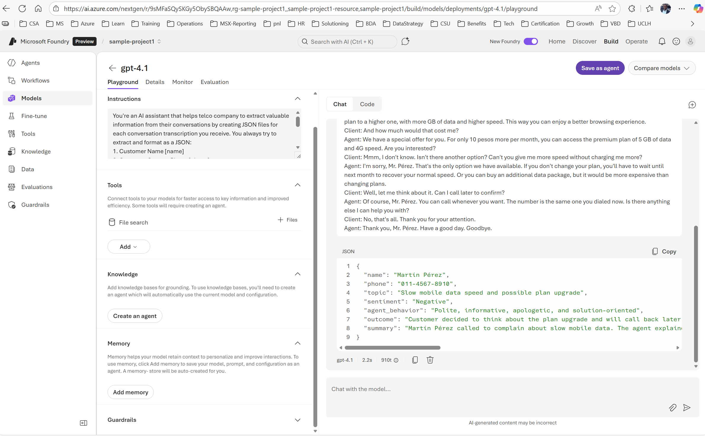


##### 2) Work with an Open Source LLM Model

Now let's test an open source Llama2 model from Meta.

For this, go to **Discover** tab of the AI Studio, select the **Models** option, and search on **GPT4**. Select **Meta-Llama-3.1-8B-Instruct** model and click on **Deploy** with **Custom Settings**


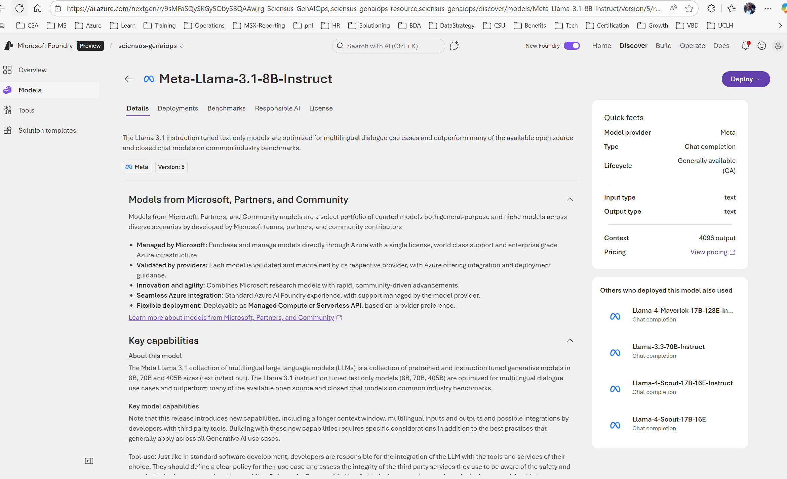

Select the model **Meta-Llama-3.1-8B-Instruct** and click on **deploy**.


Select the **Standard_NC24s_v3** compute for inference with the selected model, for this workshop one instance is enough.

If you do not have enough quota you can access the Quota option in the Managed tab to request an increase in quota for the selected resource.


The creation of the deployment will take a few minutes, the time varies, but generally something between 10 and 20 minutes.

Once its Done! Let's test this model by selecting the **Test** option on the deployment page.

Adjust the ```max_next_tokens``` parameter to 1000 so we can test the same example we used with the gpt-4.1 model.


Now just copy the text below into the "Start typing text box" and then send to observe the response generated by the Llama2 model.

```
{
  "input_data": {
    "input_string": [
      {
        "role": "system",
        "content": "You're an AI assistant that helps telco company to extract valuable information from their conversations by creating JSON documents for each conversation transcription you receive. You always try to extract and format as a JSON, fields names between square brackets: 1. Customer Name [name] 2. Customer Contact Phone [phone] 3. Main Topic of the Conversation [topic] 4. Customer Sentiment (Neutral, Positive, Negative)[sentiment] 5. How the Agent Handled the Conversation [agent_behavior] 6. What was the FINAL Outcome of the Conversation [outcome] 7. A really brief Summary of the Conversation [summary] Only extract information that you're sure. If you're unsure, write 'Unknown/Not Found' in the JSON file. Your answers outputs contains only the json document."
      },
      {
        "role": "user",
        "content": "Agent: Hello, welcome to Telco's customer service. My name is Juan, how can I assist you? Client: Hello, Juan. I'm calling because I'm having issues with my mobile data plan. It's very slow and I can't browse the internet or use my apps. Agent: I'm very sorry for the inconvenience, sir. Could you please tell me your phone number and your full name? Client: Yes, sure. My number is 011-4567-8910 and my name is Martín Pérez. Agent: Thank you, Mr. Pérez. I'm going to check your plan and your data usage. One moment, please. Client: Okay, thank you. Agent: Mr. Pérez, I've reviewed your plan and I see that you have contracted the basic plan of 2 GB of data per month. Is that correct? Client: Yes, that's correct. Agent: Well, I inform you that you have consumed 90% of your data limit and you only have 200 MB available until the end of the month. That's why your browsing speed has been reduced. Client: What? How is that possible? I barely use the internet on my cell phone. I only check my email and my social networks from time to time. I don't watch videos or download large files. Agent: I understand, Mr. Pérez. But keep in mind that some applications consume data in the background, without you realizing it. For example, automatic updates, backups, GPS, etc. Client: Well, but they didn't explain that to me when I contracted the plan. They told me that with 2 GB I would have enough for the whole month. I feel cheated. Agent: I apologize, Mr. Pérez. It was not our intention to deceive you. I offer you a solution: if you want, you can change your plan to a higher one, with more GB of data and higher speed. This way you can enjoy a better browsing experience. Client: And how much would that cost me? Agent: We have a special offer for you. For only 10 pesos more per month, you can access the premium plan of 5 GB of data and 4G speed. Are you interested? Client: Mmm, I don't know. Isn't there another option? Can't you give me more speed without charging me more? Agent: I'm sorry, Mr. Pérez. That's the only option we have available. If you don't change your plan, you'll have to wait until next month to recover your normal speed. Or you can buy an additional data package, but it would be more expensive than changing plans. Client: Well, let me think about it. Can I call later to confirm? Agent: Of course, Mr. Pérez. You can call whenever you want. The number is the same one you dialed now. Is there anything else I can help you with? Client: No, that's all. Thank you for your attention. Agent: Thank you, Mr. Pérez. Have a good day. Goodbye."
      }
    ],
    "parameters": {
      "temperature": 0.8,
      "top_p": 0.8,
      "do_sample": true,
      "max_new_tokens": 1000
    }
  }
}
```

You will see a result generated by the model similar to the one shown in the image below.


##### Create a Content Safety 

Now you will discover and test with Content Safety. Therefore, follow this steps to create content safety 

Select the resource group that you previously used for your AI Project. After that, follow the steps presented in the subsequent screens to continue with the creation process, start by clicking on **Review + create** button


By the end of this lab, you will test with Content Safety. You can check and refer [Guardrails & Controls](https://learn.microsoft.com/en-gb/azure/ai-foundry/guardrails/how-to-create-guardrails?view=foundry&tabs=python) 

Details and step by step [Guardrails & contral creation](https://learn.microsoft.com/en-gb/azure/ai-foundry/guardrails/how-to-create-guardrails?view=foundry&tabs=python)

Then click on **Create** to create your service and follow steps to complete.


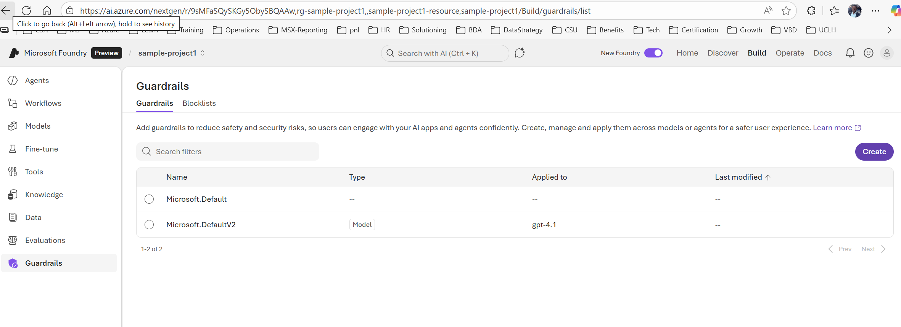

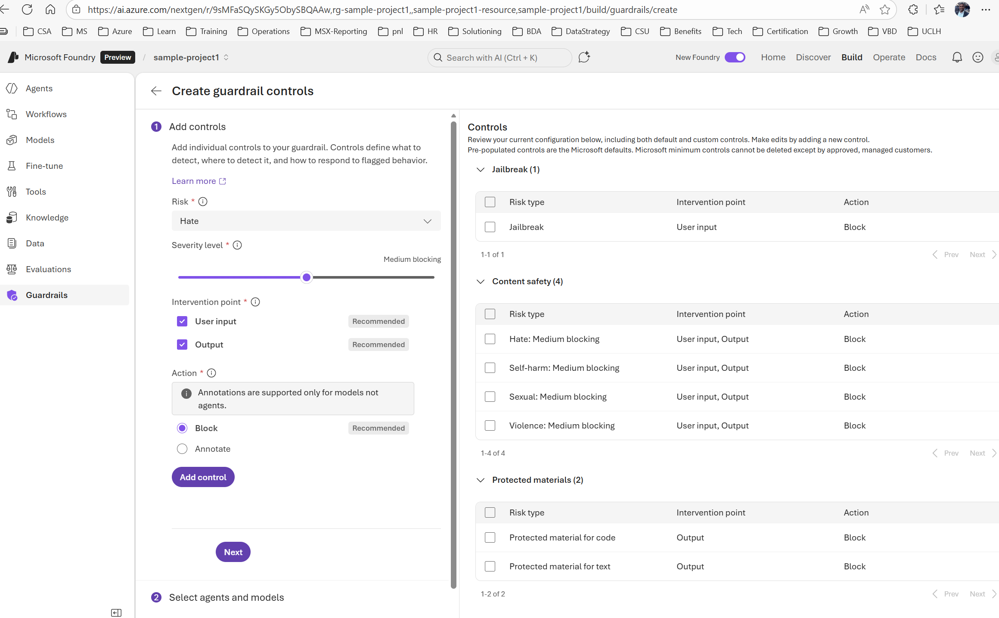

You can apply this guardrail to agents and models
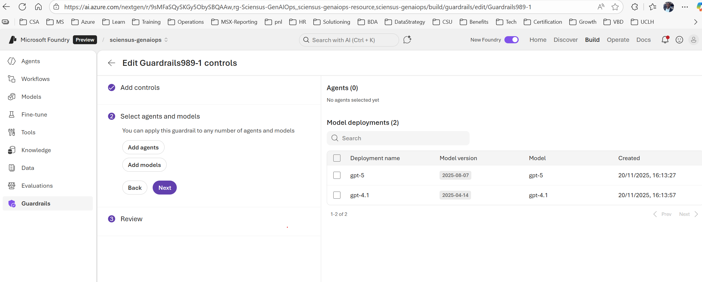


Done! The Content Safety service is now created. 

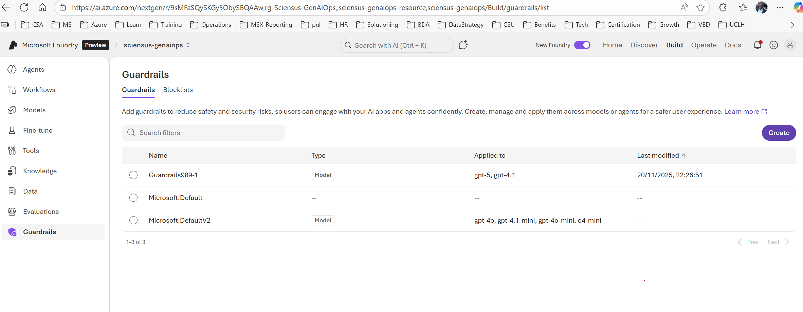


Once guardrail is created, Open playground to apply new created guardrail to specific model

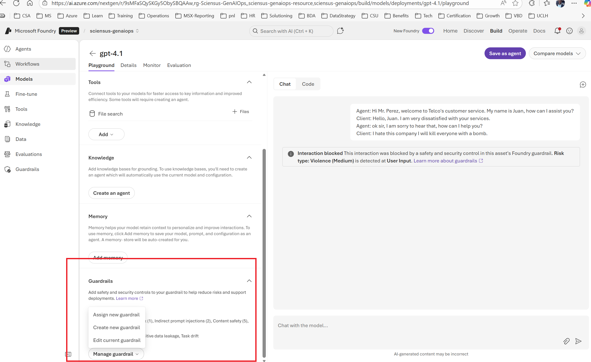

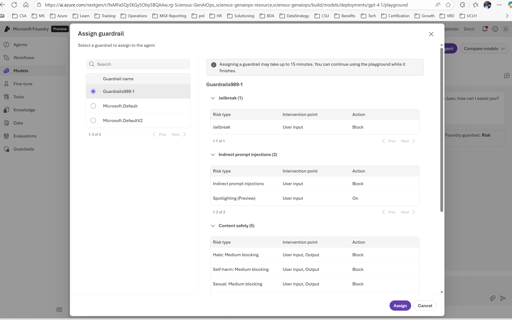

Once it has been assigned you can see as below

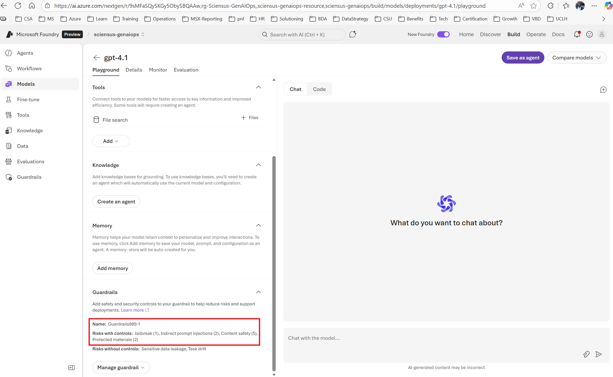


##### 3) Discover Content Safety

Now let's test how the Content Safety service can be used in conjunction with an Open Source model with Llama 2 as well as GPT model

First, let's test the behavior of the Azure OpenAI's gpt-4.1 model, select the **Playground** option from the **Build**  menu.

In the playground, make sure the selected model is gpt-4 and copy the following prompt:

```
You're an AI assistant that helps telco company to extract valuable information from their conversations by creating JSON files for each conversation transcription you receive. 

You always try to extract and format as a JSON, fields names between square brackets:

1. Customer Name [name]
2. Customer Contact Phone [phone]
3. Main Topic of the Conversation [topic]
4. Customer Sentiment (Neutral, Positive, Negative)[sentiment]
5. How the Agent Handled the Conversation [agent_behavior]
6. What was the FINAL Outcome of the Conversation [outcome]
7. A really brief Summary of the Conversation [summary]

Conversation:

Agent: Hi Mr. Perez, welcome to Telco's customer service. My name is Juan, how can I assist you?
Client: Hello, Juan. I am very dissatisfied with your services.
Agent: ok sir, I am sorry to hear that, how can I help you?
Client: I hate this company I will kill everyone with a bomb.
```

Check the response from gpt-4.1, the Violence filter was triggered with the text.

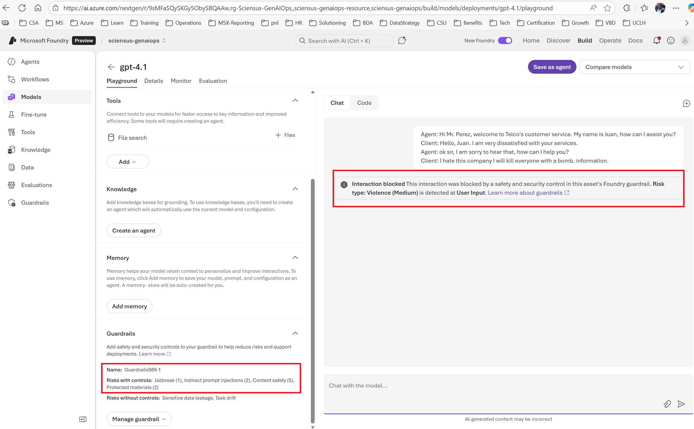


Now try with open source model **Meta-Llama-3.1-8B-Instruct** in the **Playground** , select the deployment of the Llama model to test with this Input:

```
{
  "input_data": {
    "input_string": [
      {
        "role": "system",
        "content": "You're an AI assistant that helps telco company to extract valuable information from their conversations by creating JSON documents for each conversation transcription you receive. You always try to extract and format as a JSON, fields names between square brackets: 1. Customer Name [name] 2. Customer Contact Phone [phone] 3. Main Topic of the Conversation [topic] 4. Customer Sentiment (Neutral, Positive, Negative)[sentiment] 5. How the Agent Handled the Conversation [agent_behavior] 6. What was the FINAL Outcome of the Conversation [outcome] 7. A really brief Summary of the Conversation [summary] Only extract information that you're sure. If you're unsure, write 'Unknown/Not Found' in the JSON file. Your answers outputs contains only the json document."
      },
      {
        "role": "user",
        "content": "Agent: Hi Mr. Perez, welcome to Telco's customer service. My name is Juan, how can I assist you? Client: Hello, Juan. I am very dissatisfied with your services. Agent: ok sir, I am sorry to hear that, how can I help you? Client: I hate this company I will kill everyone with a bomb."
      }
    ],
    "parameters": {
      "temperature": 0.8,
      "top_p": 0.8,
      "do_sample": true,
      "max_new_tokens": 1000
    }
  }
}
```

Notice the result of the model, content was not blocked if guaridrail is not applied or blocked otherwise


#### Removing your Llama  deployment

In this lab, you've used a **Standard_NC24s_v3** SKU to deploy your Llama model. To prevent incurring high costs, it's recommended to delete this deployment now since it won't be used in the next labs.

To do this, select **Delete deployment** on the screen with the Llama2 deployment.


Click on **Delete**, as shown in the following screen, to complete the removal.

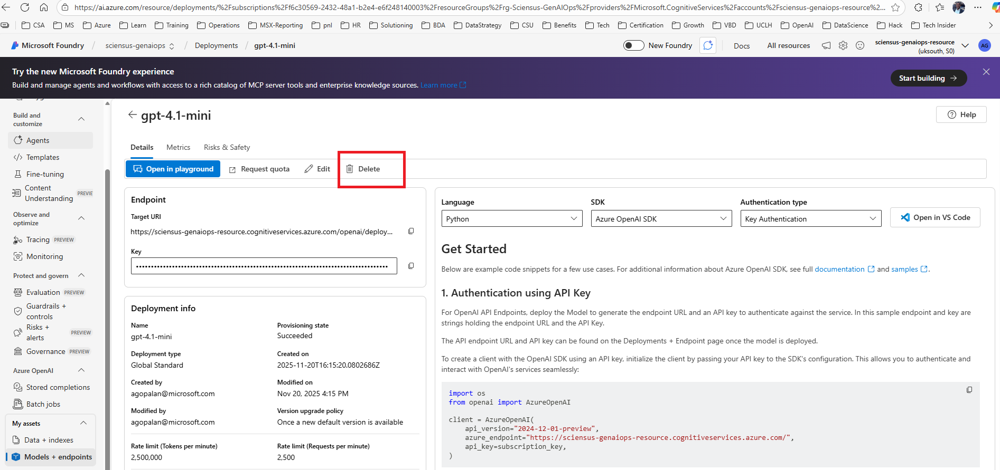
