# Lab 03: Evaluating AI Agents in Azure AI Foundry

## Overview

This lab explores Azure AI Foundry's evaluation capabilities through three distinct approaches: workflow evaluation using synthetic data, automated agent evaluation with custom metrics, and manual human evaluation. You'll learn how to measure AI agent performance using both quantitative and qualitative methods.

## Prerequisites

- Completion of Labs 1 & 2
- Access to Azure AI Foundry project
- ValidationNorthwind agent deployed from Lab 2

## Objectives

By the end of this lab, you will be able to:

- Implement automated agent evaluations with custom datasets and F1 Score metrics
- Set up and conduct manual human evaluations with custom templates
- Understand how different evaluation approaches complement each other
- Interpret evaluation results to improve AI agent performance

## Part 1: Agent Evaluation - Automated Metrics

Let's perform a precise automated evaluation of the ValidationNorthwind agent using a custom dataset with expected responses and the F1 Score metric.

### Step 1: Navigate to the Agents Section

1. In the left navigation menu, click on **Agents**.
2. You'll see a list of available agents in your project.

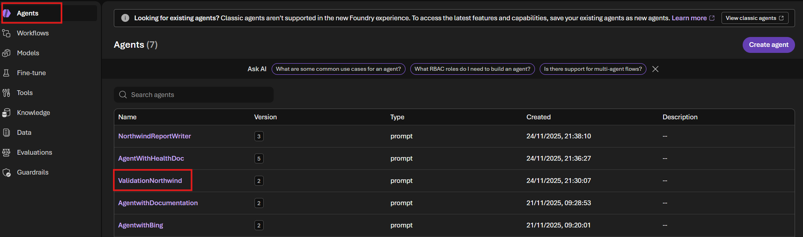

### Step 2: Select an Agent to Evaluate

1. From the agents list, select the **ValidationNorthwind** agent (or another agent you want to evaluate).
2. Click on the agent to view its details.
3. In the agent view, click on the **Evaluation** tab to access agent-specific evaluation options.


4. Click the **Create** button on the right to start a new evaluation for this agent.

### Step 3: Select Existing Dataset

1. On the **Create new evaluation** screen, you'll see that **Target: Agent** is already selected.
2. Under **Dataset source**, select **Existing dataset** option.
3. On the right side, click **Upload new dataset** to upload your test data.
4. Browse and select the `validation-test-data.jsonl` file from the data folder.

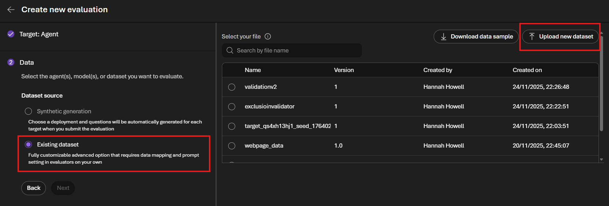

### Step 4: Verify Field Mapping

1. After uploading the dataset, you'll be taken to the **Field mapping** screen.
2. Azure AI Foundry will auto-detect and map your file columns to the standard evaluator fields.
3. Verify the mappings are correct:
   - **Query**: `{{item.query}}`
   - **Response**: `{{sample.output_text}}`
   - **Context**: Not available
   - **Ground truth**: `{{item.expected_response}}`
   - **Tool calls**: `{{sample.tool_calls}}`
   - **Tool definitions**: `{{sample.tool_definitions}}`
4. Click **Next** to proceed.

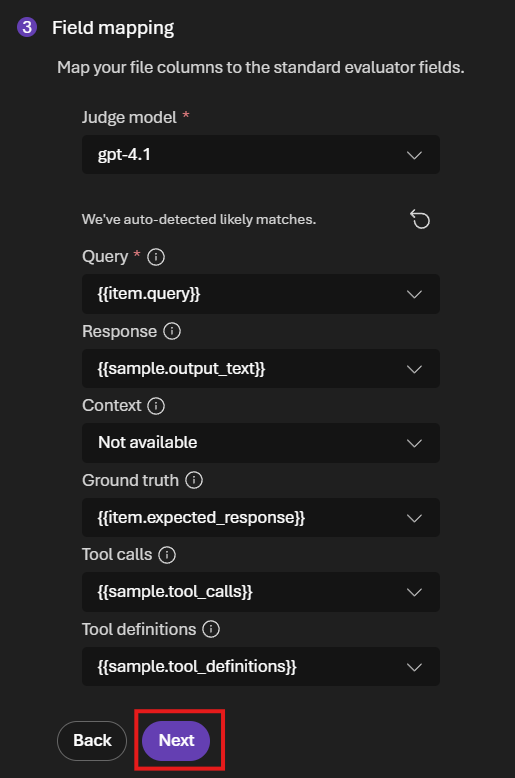

### Step 5: Remove Auto-Suggested Criteria

1. On the **Criteria** screen, Azure AI Foundry will show auto-suggested evaluators.
2. Click **Remove all** to clear all the suggested evaluation criteria.
3. We'll add custom evaluators in the next step.

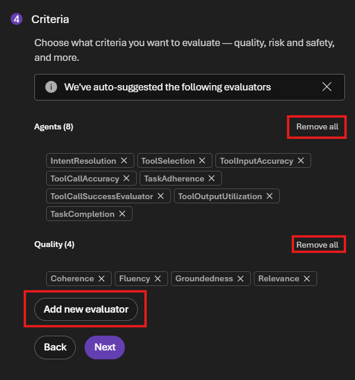

### Step 6: Add F1 Score Evaluator

1. Click **Add new evaluator** to add custom evaluation criteria.
2. Search for and select **F1 Score** from the available evaluators.
3. The F1 Score evaluator measures the accuracy of the model's predictions by calculating the harmonic mean of precision and recall.

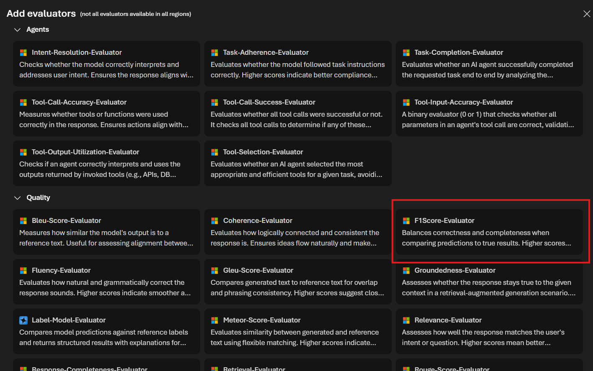

### Step 7: Configure F1 Score and Submit

**Understanding F1 Score in GenAI Evaluation:**

In traditional classification, F1 Score measures exact matches between predicted and actual classes. However, in GenAI evaluation, F1 Score works differently:

**How it works:**
- Compares the agent's generated text response against the expected response using **word/token-level overlap**
- **Precision**: What percentage of words in the agent's response match the expected response?
- **Recall**: What percentage of words from the expected response appear in the agent's response?
- **F1 Score**: The harmonic mean of precision and recall (ranges from 0 to 1, higher is better)

**Example:**
- Expected response: `"Pass"`
- Agent response: `"Pass - validated successfully"`
- Precision: 1 matching word out of 3 generated = 33%
- Recall: 1 matching word out of 1 expected = 100%
- F1 Score: ≈ 50%

**Why it's useful for ValidationNorthwind:**
For our validation agent that returns simple "Pass" or "Fail" responses:
- **High F1 Score** (close to 1.0): Agent's response matches the expected response exactly or very closely
- **Low F1 Score**: Agent's response differs from expected (wrong classification or verbose response)

This helps us measure how accurately the agent validates insurance reports for exclusions. Since we're comparing short, categorical responses, even partial word mismatches will significantly impact the F1 Score, making it an effective accuracy metric for this binary validation task.

**Configuration Steps:**

1. Verify the F1 Score configuration fields are correctly mapped:
   - **Ground truth**: `{{item.expected_response}}`
   - **Response**: `{{sample.output_text}}`
2. **Optional**: Consider changing the threshold from `0.5` to `1.0` for stricter evaluation, requiring exact matches between the agent's response and expected response.
3. Click **Next** to proceed to the review screen.
4. Review the evaluation settings and click **Submit** to run the evaluation.


### Step 8: Review and Submit Agent Evaluation

1. On the final review screen, verify all your evaluation settings.
2. Click **Submit** to start the agent evaluation.

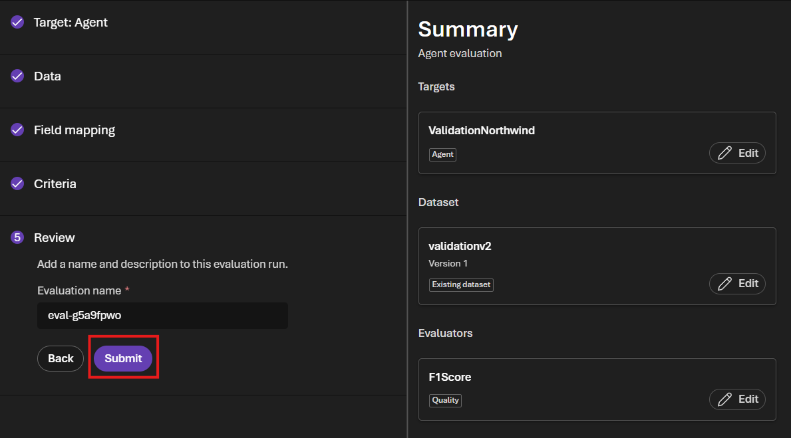

### Step 9: Monitor Agent Evaluation Progress

1. After submitting, you'll see the evaluation running.
2. Wait for the agent evaluation to complete. The evaluation will run the agent against each test case in your dataset.

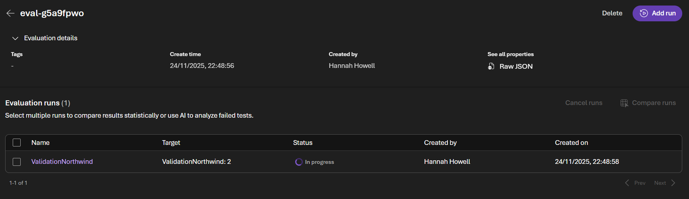

## Part 2: Agent Evaluation - Manual Human Review

While automated metrics provide quantitative measurements, human evaluation captures qualitative insights, edge cases, and nuanced behaviors that automated metrics may miss. In this section, you'll create a human evaluation template and manually test agent responses.

### Step 1: Create a Human Evaluation Template

1. Navigate back to the **ValidationNorthwind** agent's Evaluation tab.
2. Look for the option to create a human evaluation template.
3. Click **Create human evaluation template**.
4. Configure the template:
   - **Name**: Enter `Exclusion Checker`
   - **Version**: Keep as `1`
   - **Description**: (Optional) Add a description like "Validates if reports correctly identify coverage exclusions"
   - **Scoring method**: Notice the different scoring options available:
     - **thumb up/down**: Simple binary evaluation (Pass/Fail)
     - **slider**: Numerical scale evaluation (e.g., 1-5 rating)
     - **multiple choice**: Choose from predefined options
     - **free form question**: Open-ended text responses
5. For this lab, keep only the **thumb up/down** question: "Did the agent correctly identify the presence of exclusions?"
6. Remove any additional scoring methods by clicking the trash icon.
7. Click **Create** to save the template.

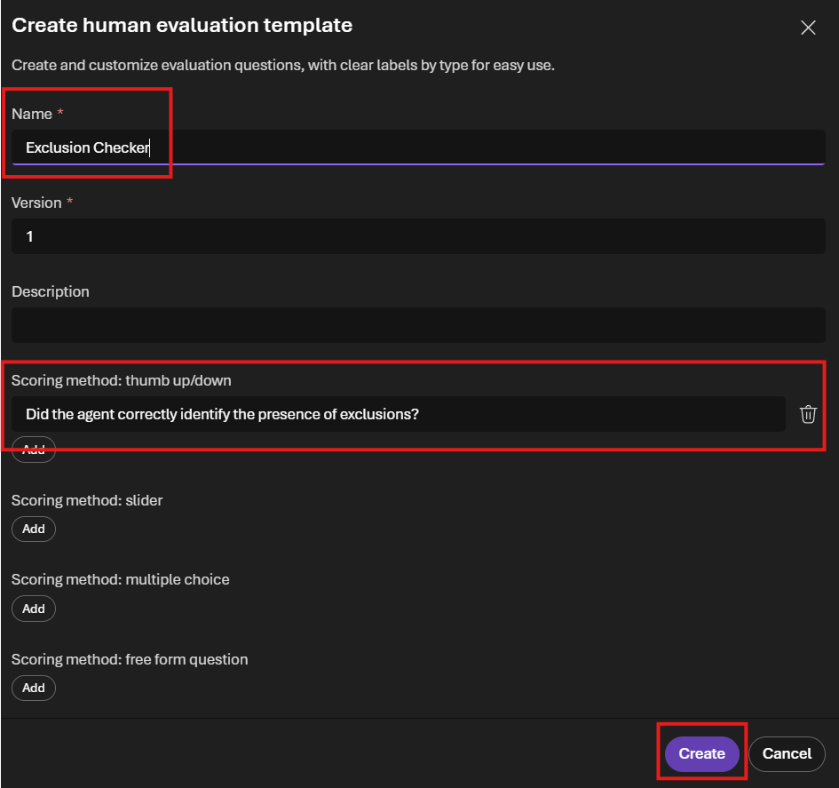

### Step 2: Set the Human Evaluation Template as Active

1. After creating the human evaluation template, you need to make it active for use.
2. Find the newly created `Exclusion Checker` template in the list.
3. Click the toggle or button to **Set as active**.
4. This makes the template available for human evaluators to use when reviewing agent responses.

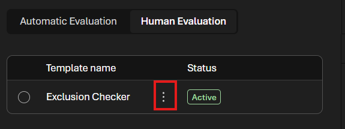

### Step 3: Apply Human Evaluation

1. Once the template is active, navigate to a completed evaluation run.
2. Human evaluators can now review agent responses using the Exclusion Checker template.
3. For each test case, evaluators can provide thumbs up/down feedback on whether the agent correctly identified exclusions.
4. This qualitative data complements automated metrics like F1 Score.

**When to use Human Evaluation:**
- Validating subjective qualities (helpfulness, tone, appropriateness)
- Checking for edge cases that automated metrics might miss
- Gathering feedback on response quality from domain experts
- Validating business-specific requirements that can't be automated
- Building ground truth datasets for training and testing

### Step 4: Manually Test the Agent

1. To manually test the agent before full evaluation, click the **Preview** button (or **Preview agent** button).
2. This opens an interactive testing interface where you can test the agent with sample inputs.

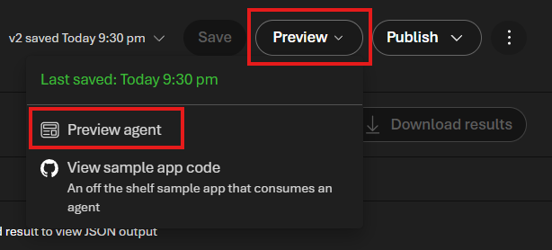

3. Copy one of the sample reports from `labs\data\northwind-health-reports.txt` and paste it into the chat interface.
4. For example, try **Report 1** (without exclusions):

```
NorthWind Health Insurance Plan provides comprehensive medical coverage for employees and their dependents. The plan includes preventive care services, routine check-ups, specialist consultations, prescription drug coverage, and emergency room visits. Annual wellness exams are fully covered with no co-payment. The plan features a $1,500 individual deductible and $3,000 family deductible. In-network providers offer the best cost savings with 80/20 coinsurance after deductible. Mental health services and telehealth options are included at no additional cost.
```

5. Observe the agent's response. It should return **"Fail"** since no exclusions are mentioned.


6. Now try **Report 2** (with exclusions):

```
NorthWind Health Insurance Plan offers extensive medical coverage including preventive care, specialist visits, and prescription benefits. Coverage includes routine examinations, diagnostic testing, and hospitalization services. The plan has a $1,500 individual deductible with 80/20 coinsurance. However, please note the following exclusions: cosmetic procedures, experimental treatments, fertility treatments, weight loss programs, and alternative medicine therapies such as acupuncture or chiropractic care beyond 12 visits annually. Dental and vision services are not included in this plan and require separate enrollment.
```

7. The agent should return **"Pass"** since exclusions are clearly stated.


### Step 5: Provide Manual Feedback on Agent Responses

1. After the agent responds, notice the **feedback icon** (clipboard/document icon) that appears under the agent's response.
2. Click on the feedback icon to open the **Exclusion Checker** evaluation panel on the right side.
3. The panel displays the human evaluation template you created earlier with the question: "Did the agent correctly identify the presence of exclusions?"
4. Provide your feedback by clicking either:
   - **Thumbs up** (👍): The agent's response is correct
   - **Thumbs down** (👎): The agent's response is incorrect
5. Click **Save** to record your manual evaluation.
6. This feedback is stored and can be aggregated to provide human evaluation metrics alongside automated scores.

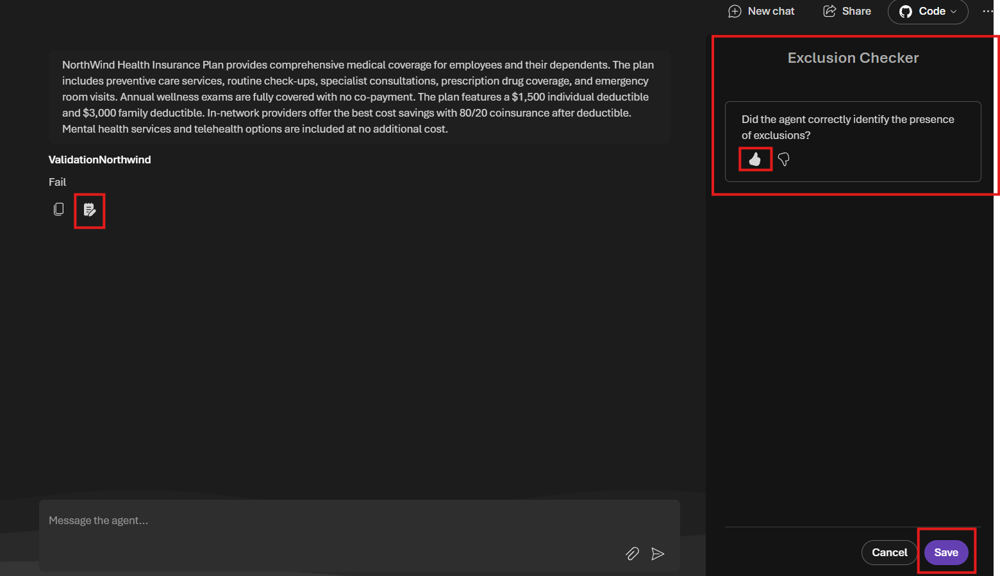

**Why manual feedback is valuable:**
- Validates that automated metrics (like F1 Score) align with human judgment
- Captures nuanced errors that automated metrics might miss
- Builds a dataset of human-validated responses for future improvements
- Provides qualitative insights into agent performance


## Explore Further

Here are some additional exercises to deepen your understanding:

### 1. Evaluate the Search Agent for Groundedness and Relevance

The search agent retrieves information to answer questions. Test its performance:
- **Evaluators to use**: Groundedness, Relevance, Retrieval Score
- **Why**: These measure if the agent's responses are factually grounded in the retrieved documents and relevant to the user's query
- **Try it**: Create a new evaluation for a search/retrieval agent using the insurance questions dataset

### 2. Experiment with Prompt Modifications

Understanding how prompt changes affect evaluation scores:
- Modify the ValidationNorthwind agent's instructions to be less precise
- Change the system prompt to introduce ambiguity or remove key validation criteria
- Re-run the evaluation and observe how F1 scores change
- **Goal**: See how prompt quality directly impacts evaluation metrics

### 3. Design Evaluations for the Report Writer Agent

The report writer generates formatted documents. Consider:
- **Suggested Evaluators**:
  - **Coherence**: Does the report flow logically?
  - **Fluency**: Is the language natural and grammatically correct?
  - **Groundedness**: Are facts based on provided data?
  - **Similarity**: How close is the output to example reports?
- **Dataset**: Create sample data with input requirements and expected report sections
- **Challenge**: Think about how to measure report structure, formatting, and completeness

### 4. Compare Multiple Evaluation Runs

- Run the same evaluation with different thresholds (0.5 vs 1.0)
- Compare results across different agent versions
- Track how changes to system prompts affect evaluation scores over time


## Summary

In this lab, you learned how to:
- Create evaluations using synthetic data generation
- Configure and run automated evaluations with built-in evaluators
- Set up agent-specific evaluations with custom datasets
- Use the F1 Score metric to measure agent accuracy in GenAI contexts
- Interpret evaluation results to improve AI applications

Key takeaways:
- **Synthetic data** is useful for quick testing and generating diverse scenarios
- **Custom datasets** with expected responses enable precise accuracy measurements
- **Different evaluators** serve different purposes (quality vs. accuracy vs. safety)
- **F1 Score in GenAI** measures word-level overlap between generated and expected responses
- **Agent evaluations** can validate specific business logic and decision-making capabilities

## Part 3: Workflow Evaluation with Synthetic Data (WIP)

> **Note**: This section is a work in progress and will be completed in a future update.

In this section, you'll create a quick evaluation using Azure AI Foundry's synthetic data generation to test a workflow with multiple evaluators.

### Step 1: Navigate to the Evaluations Tab

1. In your Azure AI Foundry project, locate the top navigation menu.
2. Click on the **Evaluation** tab to access the evaluation dashboard.

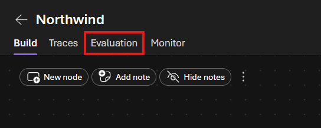

### Step 2: Create a New Evaluation

1. In the Evaluations dashboard, click the **Create** button to start a new evaluation.

### Step 3: Select Synthetic Data

1. On the evaluation creation screen, click on **Synthetic data** to generate test data for your evaluation.

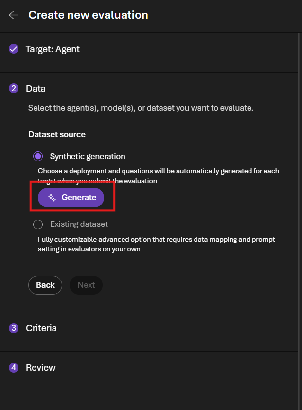

### Step 4: Configure the Synthetic Dataset

1. Set the **Number of rows** to **20** using the slider.
2. Enter the following prompt in the **Prompt** field:

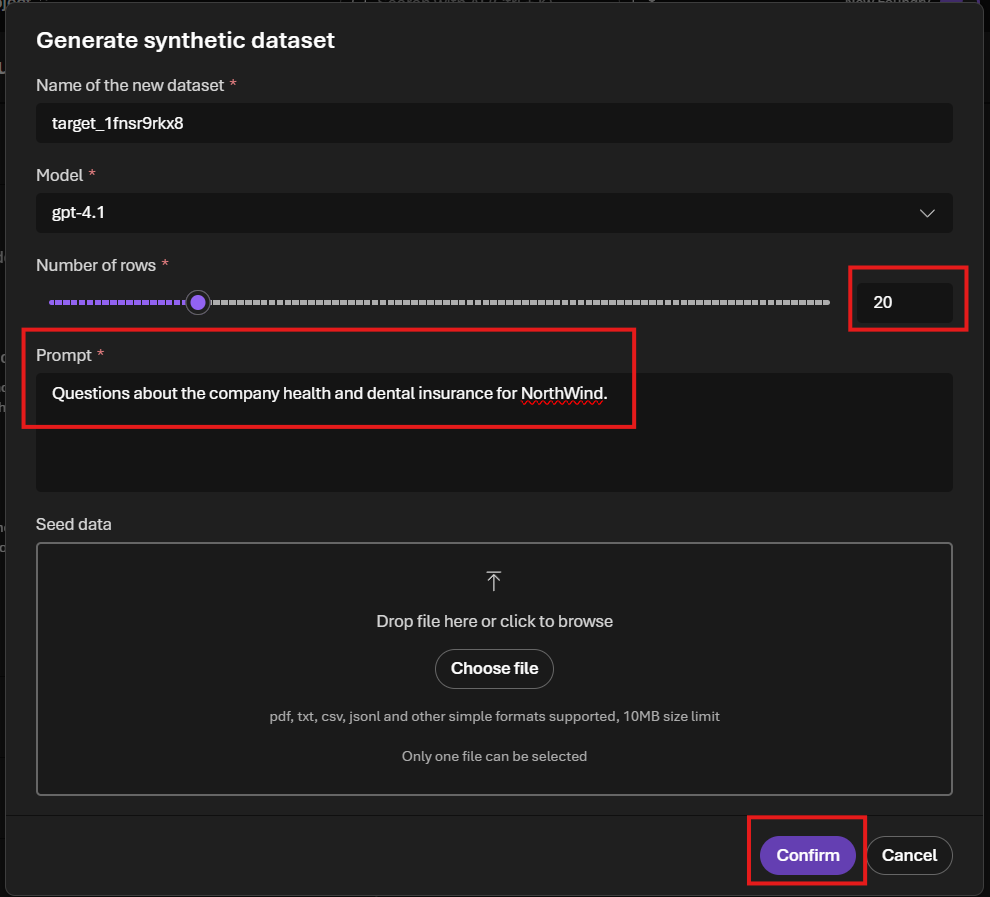

```
Questions about the company health and dental insurance for NorthWind.
```

3. Click **Confirm** to generate the dataset.

### Step 5: Select Data Source

1. Once the dataset is generated, you'll see the **Data** configuration screen showing your synthetic dataset.
2. Verify that **Synthetic generation** is selected and your dataset is displayed.
3. Click **Next** to proceed.

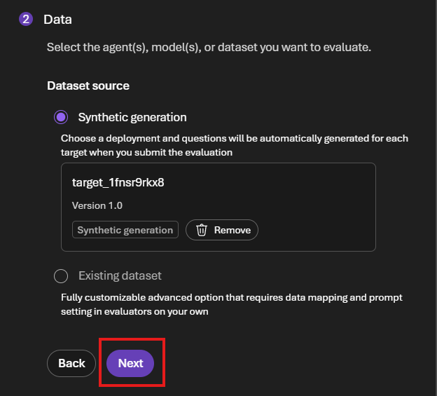

### Step 6: Review Auto-Selected Evaluation Criteria

1. On the **Criteria** screen, Azure AI Foundry has auto-suggested evaluators based on your data.
2. Review the suggested evaluators:
   - **Agents**: IntentResolution, ToolSelection, ToolInputAccuracy, ToolCallAccuracy, TaskAdherence, ToolCallSuccessEvaluator, TaskCompletion
   - **Quality**: Coherence, Fluency, Groundedness, Relevance
3. Keep the default selections and click **Next** to proceed.

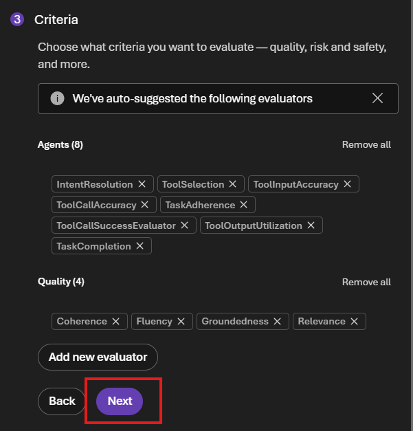

### Step 7: Review and Submit

1. On the **Review** screen, you'll see a summary with an auto-generated evaluation name.
2. Optionally, you can customize the evaluation name or add a description.
3. Click **Submit** to start the evaluation run.

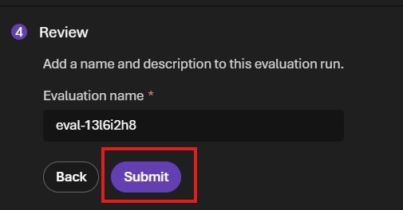

### Step 8: Monitor Evaluation Progress

1. After submitting, you'll be redirected to the evaluation status page showing the evaluation is running.
2. Wait for the evaluation to complete. This may take a few minutes depending on the dataset size and number of evaluators.

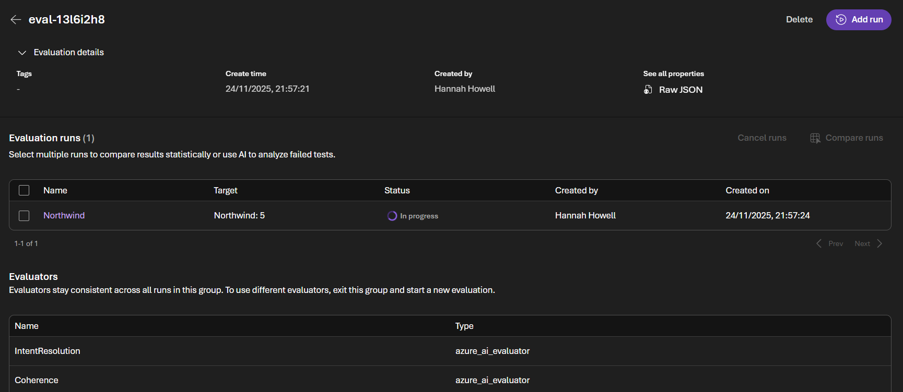

## Additional Resources

- [Azure AI Foundry Evaluation Documentation](https://learn.microsoft.com/azure/ai-studio/concepts/evaluation-approach-gen-ai)
- [Azure AI Evaluation SDK](https://learn.microsoft.com/azure/ai-studio/how-to/develop/evaluate-sdk)
- [Built-in Evaluators Reference](https://learn.microsoft.com/azure/ai-studio/how-to/evaluate-prompts-playground)
- [Custom Evaluators Guide](https://learn.microsoft.com/azure/ai-studio/how-to/develop/evaluate-sdk#custom-evaluators)

