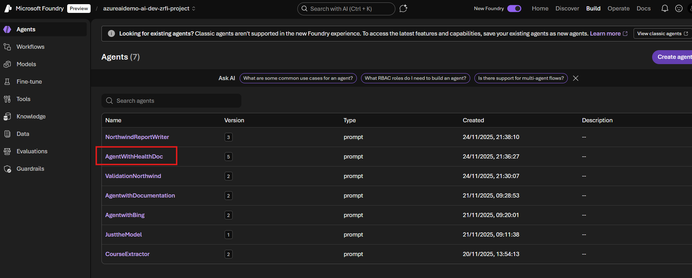
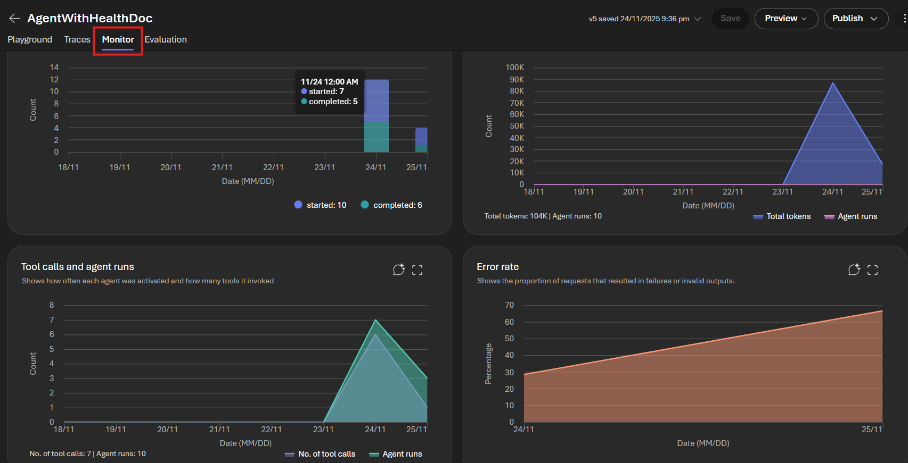
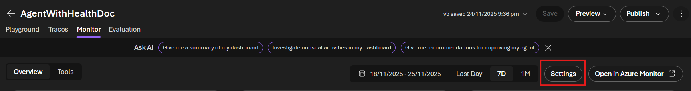
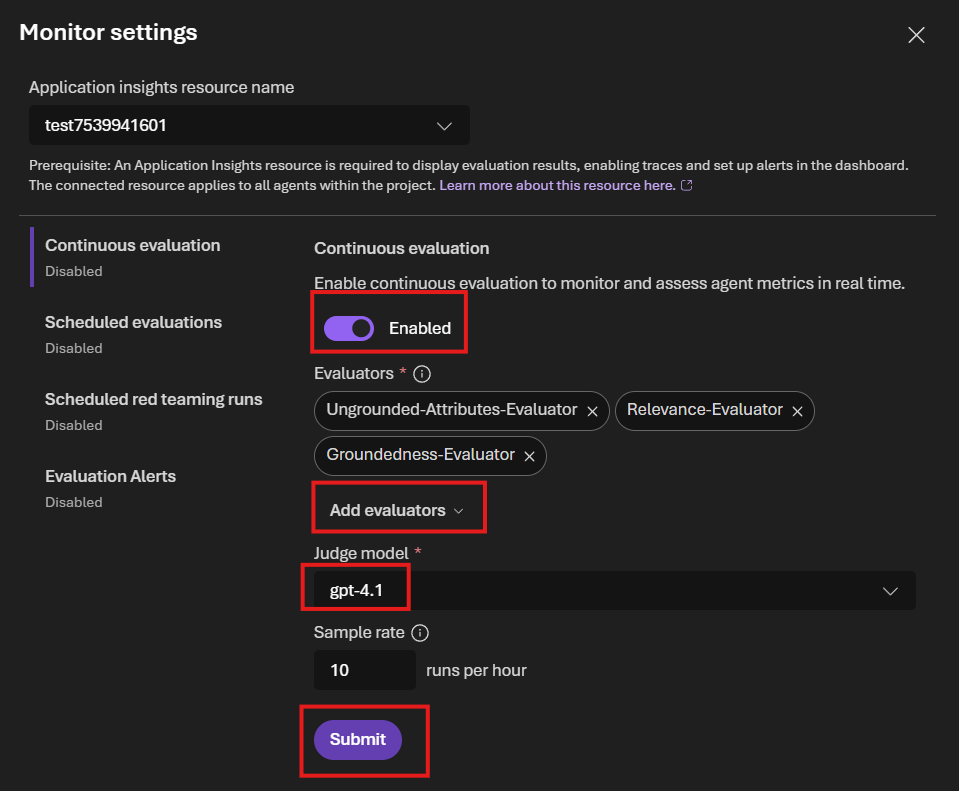
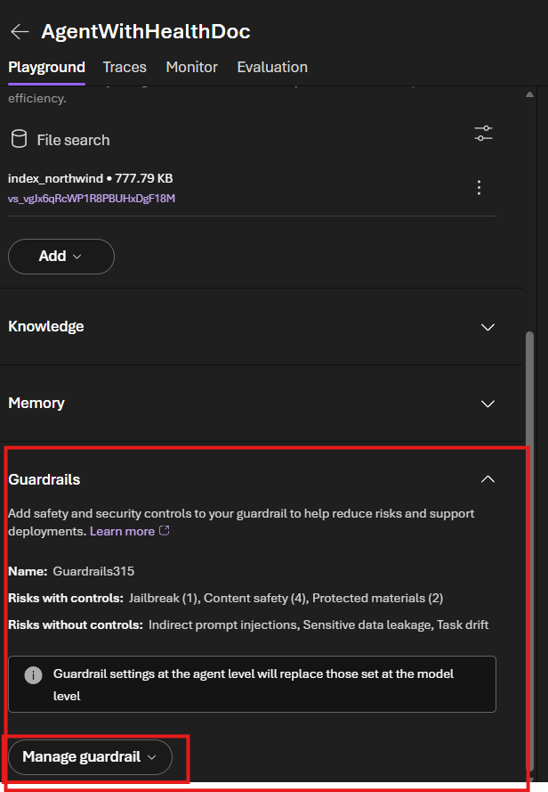

# Lab 04: Continuous Monitoring and Evaluation

## Overview

This lab focuses on implementing continuous evaluation and monitoring for AI agents in Azure AI Foundry. You'll learn how to set up automated evaluation pipelines that run continuously to ensure consistent agent performance over time.

## Prerequisites

- Completion of Labs 1, 2, and 3
- Access to Azure AI Foundry project
- Application Insights resource connected to your Foundry project
- Managed identity configured with appropriate permissions (see setup below)

### Grant Managed Identity Access

To allow your Azure Foundry project to authenticate and interact with Azure AI resources, you must grant its system-assigned managed identity the **Azure AI User** role.

1. **Open the Foundry Project Resource**: In the Azure portal, navigate to the Azure resource associated with your Foundry project (for example, the project's resource group or a specific service resource).
2. **Go to Access Control (IAM)**: In the left-hand menu, select **Access control (IAM)**.
3. **Add a New Role Assignment**: Click **+ Add** and select **Add role assignment**.
4. **Select the Azure AI User Role**: In the Role dropdown, search for **Azure AI User**, then select it.
5. **Choose the Managed Identity**:
   - Under **Assign access to**, choose **Managed identity**.
   - Select the system-assigned managed identity for your Foundry project from the list.
6. **Review and Assign**: Review your selections and click **Review + assign** to complete the configuration.

Once assigned, the project's managed identity will have the necessary permissions to access and use Azure AI services by default.

## Objectives

By the end of this lab, you will be able to:

- Set up continuous evaluations for AI agents
- Configure automated evaluation pipelines
- Monitor agent performance over time

## Part 1: Setting Up Continuous Evaluations

Continuous evaluations allow you to automatically assess agent performance on an ongoing basis, ensuring quality remains consistent as your agents evolve.

### Step 1: Navigate to Agents and Select the Agent to Monitor

1. In the left navigation menu, click on **Agents**.
2. From the agents list, select the agent you want to set up continuous monitoring for (e.g., **AgentWithHealthDoc**).
3. Click on the agent to open its details.

 

### Step 2: Access the Monitor Tab

1. Once the agent details page opens, navigate to the **Monitor** tab at the top of the page.
2. The Monitor tab displays comprehensive metrics about your agent's performance and usage.

The monitoring dashboard provides several key insights:
- **Agent runs**: Track the number of started and completed agent runs over time
- **Total tokens**: Monitor token consumption and agent run frequency
- **Tool calls and agent runs**: View how often the agent is activated and how many tools it invokes
- **Error rate**: Identify the proportion of requests that resulted in failures or invalid outputs

### Step 3: Access Monitor Settings

1. In the Monitor tab, click the **Settings** button in the upper right corner.

### Step 4: Configure Continuous Evaluation

1. In the Monitor settings dialog, toggle **Continuous evaluation** to **Enabled**.
2. The evaluators section will appear. Select the following three evaluators:
   - **Ungrounded-Attributes-Evaluator**
   - **Relevance-Evaluator**
   - **Groundedness-Evaluator**
3. If needed, click **Add evaluators** to select additional evaluators.
4. Under **Judge model**, select **gpt-4.1** (or your preferred model).
5. Set the **Sample rate** to **10 runs per hour** (or your desired frequency).
6. Click **Submit** to save the configuration.

### Step 5: Review Evaluation Results in Traces

1. Navigate to the **Traces** tab to view detailed execution logs and evaluation results.
2. Each trace shows:
   - Agent execution flow and tool calls
   - Continuous evaluation scores from the configured evaluators
   - Performance metrics and token usage
3. Filter traces by date range or evaluation results to identify patterns.

## Part 2: Configuring Agent Guardrails

Guardrails add safety and security controls to your agent, helping to reduce risks and support safe deployments. In this section, you'll explore the guardrail settings available in the agent playground.

### Step 1: Navigate to Agent Playground

1. From the agent details page, click on the **Playground** tab at the top.
2. This opens the interactive testing environment for your agent.

### Step 2: Access Guardrails Settings

1. In the left sidebar of the playground, scroll down to locate the **Guardrails** section.
2. Expand the **Guardrails** section to view the available safety and security controls.

### Step 3: Review Guardrail Configuration

The Guardrails section displays:
- **Name**: The current guardrail configuration (e.g., Guardrails315)
- **Risks with controls**: Protected risks such as:
  - **Jailbreak** attempts
  - **Content safety** violations
  - **Protected materials** (copyright/IP)
- **Risks without controls**: Unprotected risks such as:
  - Indirect prompt injections
  - Sensitive data leakage
  - Task drift

### Step 4: Experiment with Guardrail Settings

1. Click **Manage guardrail** to modify the configuration.
2. Experiment with different settings:
   - Enable or disable specific risk controls
   - Adjust severity thresholds for content safety
   - Configure blocked content categories
   - Test custom guardrail rules
3. Save your changes and test the agent in the playground to observe how guardrails affect responses.

**Note**: Guardrail settings at the agent level will replace those set at the model level.

